# 📝 Super notes (Sparkles note)

## Avancement
- Page d'accueil ✅ 

## 💬 Description de l’application

Super notes est une application qui permet de prendre des **notes rapides et/ou élaboré** et de les éditer à notre sauce. Elle se basera sur l’application google keep mais intégra les points forts d’autres applications de notes notamment notion. Ça va permettre aux gens d’avoir leurs notes centraliser sur une application et aussi bien sur le desktop que sur leurs téléphones.

## ❓ Pourquoi faire une application de note alors qu’il y en a des tas qui existent

1. Parce que je ne connais aucune application de notes qui est à la fois agréable pour prendre des notes rapides et des notes de cours, ce qui oblige à avoir 2 applications de prise de notes pour pouvoir satisfaire ce besoin au lieu de tout avoir centralisé.
2. J’utilise ces 2 types de notes quotidiennement donc je sais relativement bien ce dont les gens ont besoin et ou appuyer
3. Parce qu'on est mieux servis par sois même

## 👩 Public ciblé (Persona)

à faire

## 📈 Analyse de l’existante

Ici je vais analyse les points forts et points faibles des applications les connues

### Google Keep
 

| ✅ Pour                                                                                                                                                                                                                                                                                                             | ❌ contre                                                                                                                                                                                                                                                                                                                                                                                                                                                                            |
|--------------------------------------------------------------------------------------------------------------------------------------------------------------------------------------------------------------------------------------------------------------------------------------------------------------------|-------------------------------------------------------------------------------------------------------------------------------------------------------------------------------------------------------------------------------------------------------------------------------------------------------------------------------------------------------------------------------------------------------------------------------------------------------------------------------------|
| - On peut rapidement faire des notes  - On prendre des notes vocal  - On peut dessiner   - On peut mettre des rapples sur les notes - On peut mettre des labes sur les notes - Leurs donner une couleur - Mode sombre - Une bonne vue d’ensemble des notes - On peut pin nos notes |   - Avoir a la fois une liste de tâches et des textes dans une note.   - Placer des images où on veut dans la note.   - Avoir une vue d’ensemble chronologique sur les rappels/notes.   - Changer le style du texte de nos notes (mettre en gras, en couleur, en italique).   - Rajouter du dessin sur nos notes.   - Cacher des notes et avoir un mots de passe pour les voir.   - Avoir un espace freeform ?   - prends pas en charge le markdown |

### notion

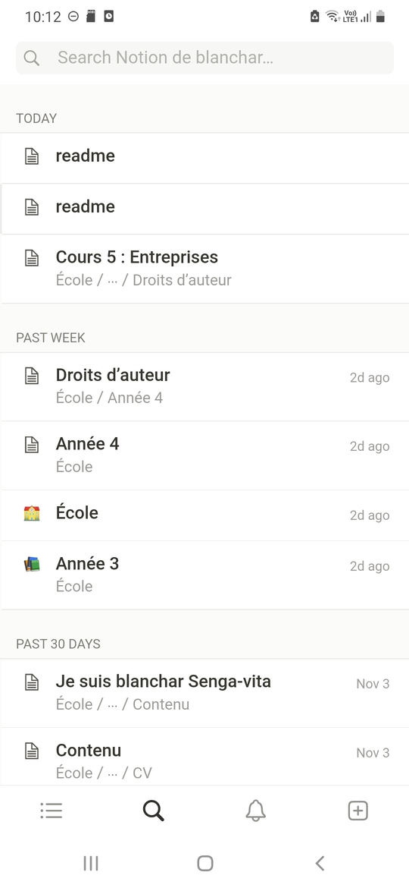

| ✅ pour                                                                                                                                                                                                                                                                                                        | ❌ contre                                                                                                                                                                                                                                                        |
|---------------------------------------------------------------------------------------------------------------------------------------------------------------------------------------------------------------------------------------------------------------------------------------------------------------|-----------------------------------------------------------------------------------------------------------------------------------------------------------------------------------------------------------------------------------------------------------------|
| - On peut imbriquer des notes dans des notes   - Nos documents sont en markdown   - On peut styliser son workflow   - On peut avoir ses notes sur d’autres platforme   - on peut chercher nos notes avec une chronologie   - on peut rajouter des tableaux et des base de donner de chose | - Compliqué à prendre en main   - on peut pas rajouter des dessins deçu   - Avoir des rappels pour les notes  - L’app ne favorise pas les quick notes   - On a pas une vue d’ensemble des notes   - On peut pas styliser à notre gouts nos notes |

### Samsung Notes

| ✅ pour                                                                                                                                                        | ❌ contre                                                                                                            |
|---------------------------------------------------------------------------------------------------------------------------------------------------------------|---------------------------------------------------------------------------------------------------------------------|
| - On peut créer des dossiers de nos notes  - On peut placer son contenu comme on veut sur la page de note  - On peut styliser à notre gouts nos notes | - On ne peut pas avoir ses notes sur d’autres platforme (android seulement)  - prends pas en charge le markdown |

### Evernote

| ❌ contre                                                                                                                   |
|----------------------------------------------------------------------------------------------------------------------------|
| - Payant (je n'ai pas pu experimenté plus)                                                                                 |

### Apples Notes
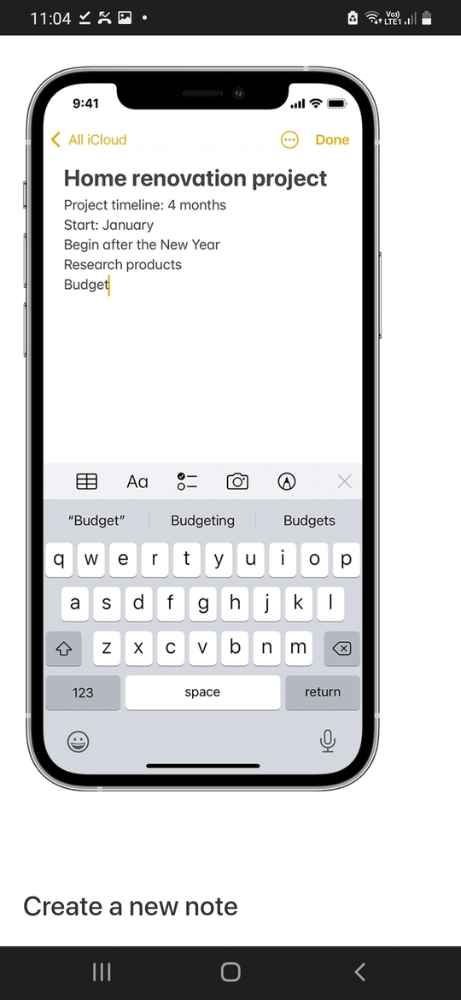
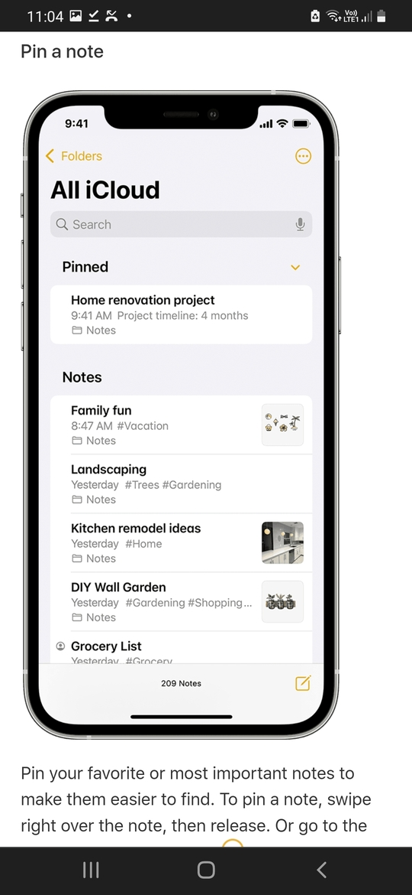
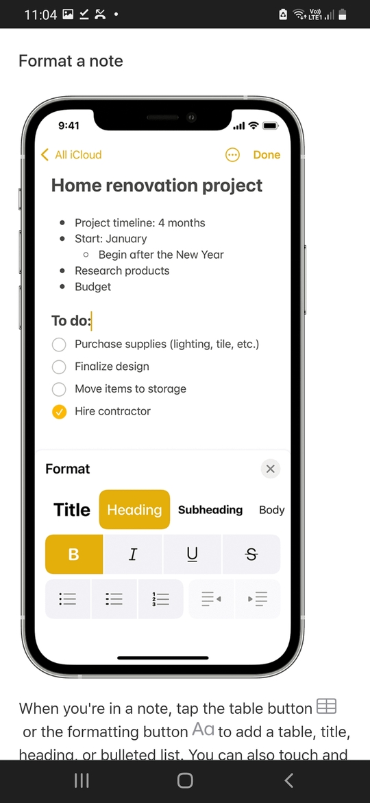
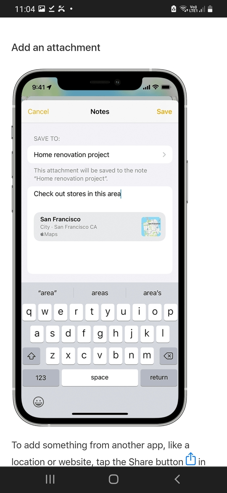
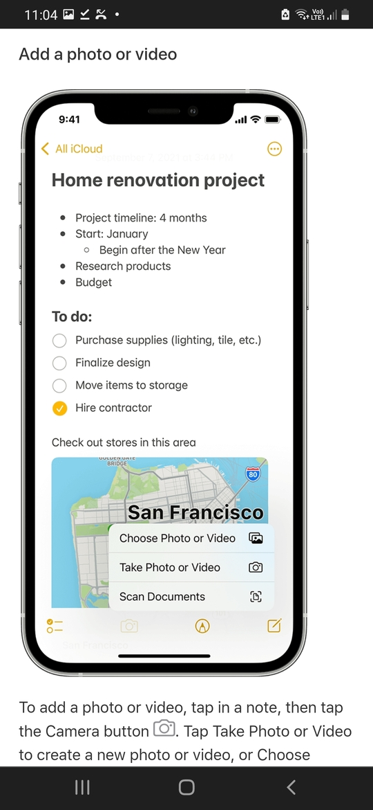
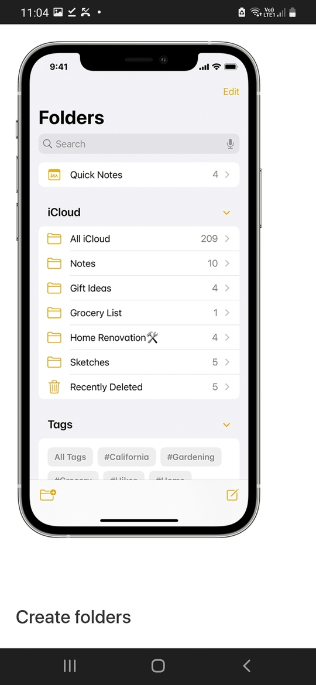
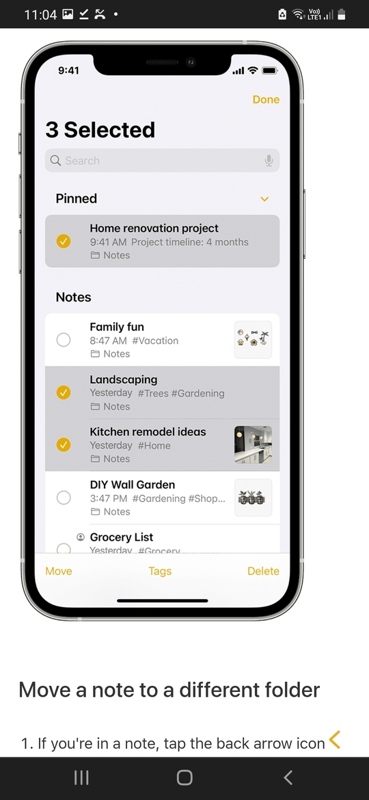
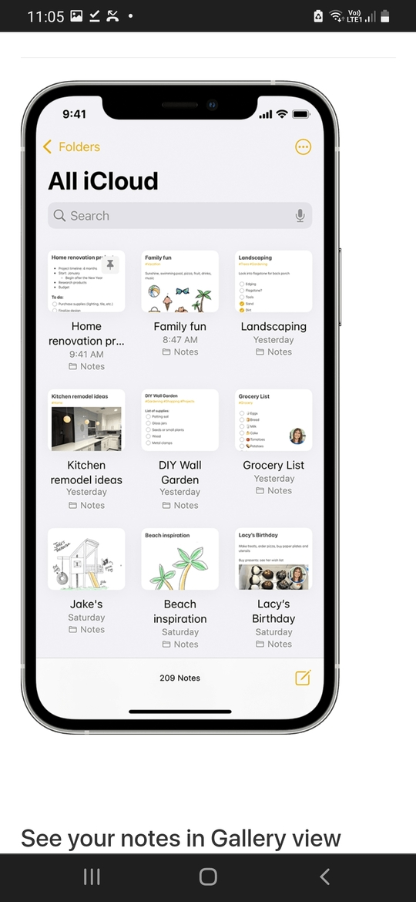
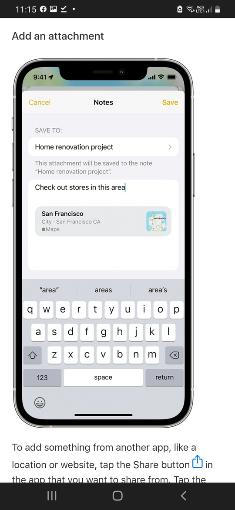

| ✅  pour | ❌ contre |           
|-----|-----------|
| - on peut conserver nos notes dans le cloud  - on peut mettre plusieurs rappelles dans une notes  - on peut styliser nos notes  - on peut avoir des dossier de nos notes | - disponible que sur IOS (pas pu voir les défauts  - prends pas en charge le markdown  - disponible sur une seule platform |

### Easy notes

| ✅ pour                                                                        | ❌ contre                                                                    |
|-------------------------------------------------------------------------------|-----------------------------------------------------------------------------|
| - calendrier ou on peut ajouter des notes dessus   - ajouté un des labels | - theme personalisable   - pub  - disponible sur une seule platform |

 

### Mind notes

| ✅ pour                                               | ❌ contre                                                             |
|------------------------------------------------------|----------------------------------------------------------------------|
| - ajouté un des labels - workflow personalisable | - pub - disponible sur une seule platform                        |

## ⚙️ Fonctionnalités possibles
Voici une liste non exhaustif des choses que je pourrais mettre en place dans mon application (les choses à faire en 1er)

- se créer un compte
- se connecter
- **prendre des notes (en 1 clique)**
- selectionner les notes, trier les notes, changer de vues
- mettre des rappels sur des notes
- un récap des rappels
- pin des notes
- avoir des outils d'éditeurs de texte qui permette de
  - changer la taille, la couleur de la police
  - mettre en gras, italique, en barré, surligné, souligné etc
  - changer la justification du texte
- dans la note on pourra
  - rajouter des images
  - avoir une galerie d'image (à la twitter/notion)
  - dessiner sur une image
  - (mettre des calendriers dans les notes, pas encore sur de celle-là)
- choisir où on veut sauvegarder la note
- faire des listes à puces
- avoir un système de synthèse vocale, pas encore sûr
- mettre des notes dans des notes
- mettre des libellés, juste avec un #quelquechose on créer un label ou on peut ajouter un autre label, ajouter un liste genre (playlist ytb)
- (affichage freeform contraiment à notion qui est fort modulaire)
- archiver des notes
- retrouver des notes avec une barre de recherche
- partager ses notes, pouvoirs ajouter des collaborateurs.
- avoir un dossier de notes
- les rappels en fonction des dates
- mettre des database ?
- mettre des formes ? ecrire dans les forms
- pouvoir activer des notifiaction push-up pour certaine notes durant une certaine heure sur une ligne de textes, imaginons que t'es en ville de 16 à 19h et tu dois aller chez le coordonier, puis achecter un chou et deposer une lettre, au lieu de devoir deverrouiller ton téléphone pour et aller sur l'app de note juste tu deverouille l'ecran scroll la barre de nav et tu peux voir (ou meme checker) les élément de la liste ?
- choisir si une note peut prendre quelle taille dans l'affichage
- affichage de lien

### 💵 Possibilité de fonctionnalités payantes

- Les themes ?

## ⚒️ UX

### Moodboard UX
https://www.behance.net/collection/199080793/Super-notes
https://www.pinterest.com/anchar2107/super-notes/

#### Page home + cartes des notes
  ` 

audio => snapchat

#### barre de navigation
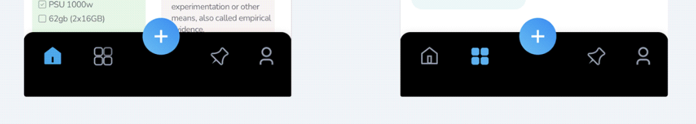
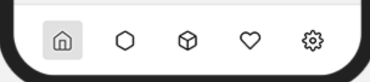
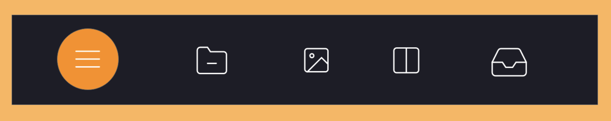
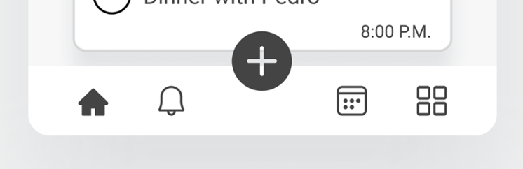
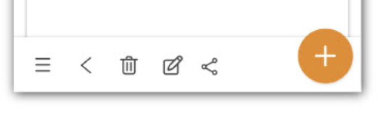

#### barre du haut

#### Page de recherche
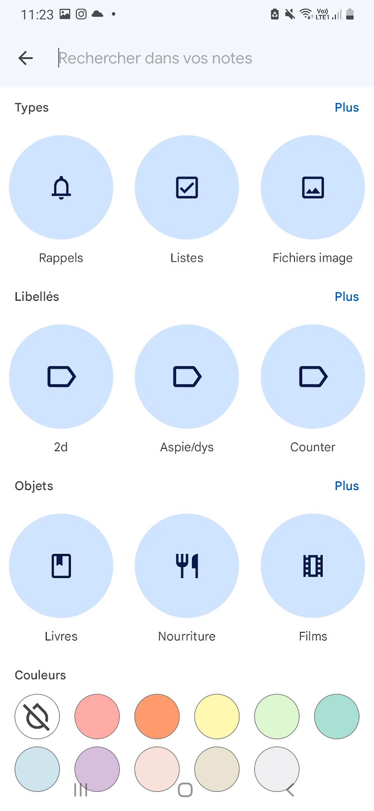

#### page de note

#### page de rappels

#### page de catégories

#### sidebar

#### page login

#### page d'inscription

#### page forgot mdp

#### page forgot mdp (lien de reinitialisation envoyé)

#### page d'onboarding

#### Les autres pages
reste a faire

Behance + pinterest 

### Priority guidelines
- page home
  - la barre de navigation
  - top app bar
  - cartes des notes
    - vocale
    - dessin
    - image
    - liste à puces
    - texte simple
    - nouveau dossier ?

- une top app bar
  - compte
  - menu slide barre
  - comment afficher l'app
  - trier par date ?
  - Affichage ?

- une barre de navigation
  - créer une note
    - dessin
    - vocale
    - note
    - case à cocher
  - home
  - catégories
  - rappels

- page de recherche
  - mettre des filtre pour savoir si il cherchent une note qui contient
    - des audios
    - des images
    - des dessins
    - un tag specifique
    - une couleur spécifique ?

- page de note
  - un emplacement pour le titr
  - une fleche (un bouton) pour sortir de la note
  - une barre editeur
    - style
      - italique
      - gras
      - souligné
  - surlignage
  - revert ou non ce qu'on a écrit
  - taille de la police
  - type de police (la choisir)
  - rajouté des fichiers
    - puces (rond et chiffre)
    - liste à coché
    - vocales
    - dessin
    - images
  - justification ?
  - alinéa ?

- page rappels
  - la barre de navigation (juste pour les rappels)
  - top app bar
  - listes des rappels

- page categories
  - la barre de navigation (juste pour les catégories)
  - top app bar
  - Dossiers des catégories

- compte (ou Sidebar)
  - nom de l'utilisateur
    - email en dessous
  - Parametres
  - Archive
  - Corbeille
  - logout

- page login
- page d'inscription
- page forgot mdp
- page forgot mdp (lien de reinitialisation envoyé)
- 3 page d'onboarding

### Prototype
Sur papier (les photos arrivent)

## 🖼️ UI

### mots-clé
- Simple
- intuitif
- universel (qui parle à plus de monde possible (en occident en tout cas)

### moodboard
- notion
- concept studio

### couleur
On va prévoir des thèmes pour les couleurs mais on va faire notre application en :
- Noir 
- blanc

### logo
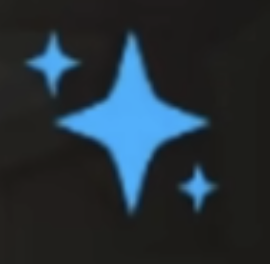

(piste pour le logo si on l'appelle sparkles notes ?)

### Police d'écriture
SF pro : On va reprendre la police natif du mobile (ici sur IOS) afin que l'utilisateur ne voit pas ses habitudes changer et il pourra se sentir "comme chez lui", de plus c'est des polices qui déjà fait leur preuve sur mobile. Elle est peut-être utilisée aussi bien sur du texte de labeur et que de titrage et a aucune conotation particulière(ce qu'on veut pour que notre app "parle à tout le monde"). (j'existais avec roboto)

### icônes
https://heroicons.com

### Illustration
Rien pour l'instant, ce n'est pas une priorité pour l'instant. On y retravaillera plus tard

### barre de navigation

### Buttons

### Inputs

### card

## Design complet